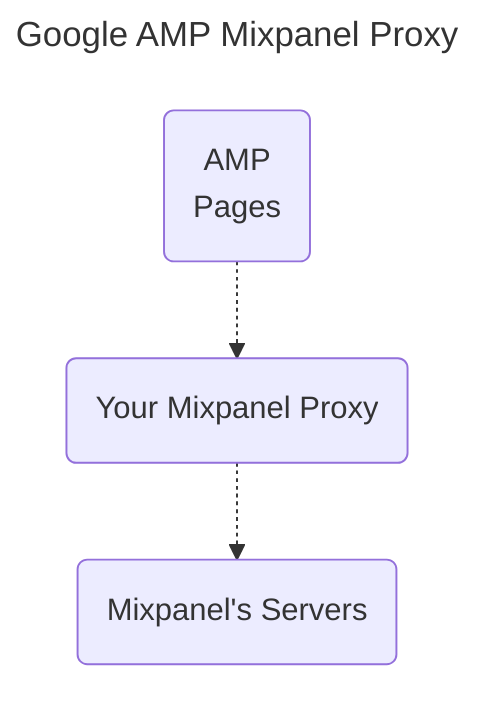

# AMP Pages Mixpanel Proxy

A basic Mixpanel proxy for use with [`<amp-analytics>` components on Google Amp Pages](https://amp.dev/documentation/components/websites/amp-analytics).

## Demo

<a href="https://youtu.be/9Cv4EmdUyd4"></a>

## Setup the Proxy

The proxy server sits between your AMP pages and Mixpanel's ingestion API:



You can run the proxy on your own infrastructure or use a serverless provider; choose a deployment strategy below.

Once you have a URL for the proxy, you can **[configure your front-end](#frontend)** to send requests to your proxy.

### One Click Deploys!

[![Google Cloud Btn]][Google Cloud Deploy]
[][Digital Ocean Deploy]
[![Railway Btn]][Railway Deploy]
[![Render Btn]][Render Deploy]

[Google Cloud Btn]: https://binbashbanana.github.io/deploy-buttons/buttons/remade/googlecloud.svg
[Google Cloud Deploy]: https://deploy.cloud.run?git_repo=https://github.com/ak--47/mixpanel-amp-proxy
[Digital Ocean Btn]: https://www.deploytodo.com/do-btn-blue.svg
[Digital Ocean Deploy]: https://cloud.digitalocean.com/apps/new?repo=https://github.com/ak--47/mixpanel-amp-proxy
[Railway Btn]: https://binbashbanana.github.io/deploy-buttons/buttons/remade/railway.svg
[Railway Deploy]: https://railway.app/template/1ZbUOb?referralCode=t6z7XI
[Render Btn]: https://binbashbanana.github.io/deploy-buttons/buttons/remade/render.svg
[Render Deploy]: https://render.com/deploy?repo=https://github.com/ak--47/mixpanel-amp-proxy

### Manual Deploys

##### GCP Manual Deploy:

```bash
# clone repo
git clone https://github.com/ak--47/mixpanel-amp-proxy.git
cd mixpanel-amp-proxy

# set project id and enable cloud run and cloud build
gcloud config set project YOUR_GCP_PROJECT_ID
gcloud services enable run.googleapis.com cloudbuild.googleapis.com

gcloud builds submit --tag gcr.io/YOUR_GCP_PROJECT_ID/mixpanel-amp-proxy
gcloud run deploy mixpanel-amp-proxy --image gcr.io/YOUR_GCP_PROJECT_ID/mixpanel-amp-proxy --platform managed --allow-unauthenticated
```

then copy the url of the deployed service; you will use this as the value of `requests` key in your `<amp-analytics>` component (replace with `{{YOUR-PROXY}}`)

##### AWS Manual Deploy:

```bash
# clone repo
aws configure
git clone https://github.com/ak--47/mixpanel-amp-proxy.git
cd mixpanel-amp-proxy


# create ECR repo and login
aws ecr create-repository --repository-name mixpanel-amp-proxy
aws ecr get-login-password --region your-region | docker login --username AWS --password-stdin your-account-id.dkr.ecr.your-region.amazonaws.com

# build and push image to ECR
docker build -t mixpanel-amp-proxy .
docker tag mixpanel-amp-proxy:latest your-account-id.dkr.ecr.your-region.amazonaws.com/mixpanel-amp-proxy:latest
docker push your-account-id.dkr.ecr.your-region.amazonaws.com/mixpanel-amp-proxy:latest

# create a lambda function to run the container
aws lambda create-function --function-name mixpanel-amp-proxy \
--package-type Image \
--code ImageUri=your-account-id.dkr.ecr.your-region.amazonaws.com/mixpanel-amp-proxy:latest \
--role arn:aws:iam::your-account-id:role/your-lambda-role
```

^ then configure your lambda to a public API Gateway endpoint, and copy the url of the deployed service; you will use this as the value of `requests` key in your `<amp-analytics>` component (replace with `{{YOUR-PROXY}}`)

<div id="frontend"></div>

## Configure Front End

- within `<head>` tag, include [required scripts](https://amp.dev/documentation/components/amp-analytics)

```html
<script async custom-element="amp-analytics" src="https://cdn.ampproject.org/v0/amp-analytics-0.1.js"></script>
```

- within `<body>` tag, include `<amp-analytics>` component [for sending in-house](https://amp.dev/documentation/components/amp-analytics#send-data-in-house); this is the MINIMUM configuration required:

```html
<amp-analytics>
  <script type="application/json">
    {
      "requests": {
        "event": "https://{{YOUR-PROXY}}/event",
        "user": "http://{{YOUR-PROXY}}/user"
      },
      "vars": {
        "userId": "",
        "anonymousId": "CLIENT_ID(mixpanel_amp_id)",
        "token": "YOUR_MIXPANEL_TOKEN",
        "idMgmtVersion": 3
      },
      "transport": {
        "beacon": false,
        "xhrpost": true,
        "image": false,
        "useBody": true
      },
      "linkers": {
        "mixpanel": {
          "ids": {
            "mixpanel_amp_id": "${anonymousId}"
          },
          "proxyOnly": false
        }
      },
      "cookies": {
        "mixpanel_amp_id": {
          "value": "LINKER_PARAM(mixpanel, mixpanel_amp_id)"
        }
      },
      "extraUrlParams": {
        "eventName": "${eventName}",
        "userId": "${userId}",
        "anonymousId": "${anonymousId}",
        "token": "${token}",
        "time": "${timestamp}",
        "user_agent": "${userAgent}",
        "idMgmtVersion": "${idMgmtVersion}",
        "defaultProps": {
          "$screen_height": "${viewportHeight}",
          "$screen_width": "${viewportWidth}",
          "$referrer": "${documentReferrer}"
        },
        "superProps": {}
      },
      "triggers": {
        "trackPageView": {
          "on": "visible",
          "request": "event",
          "vars": {
            "eventName": "page view"
          },
          "extraUrlParams": {
            "$current_url": "${sourceUrl}",
            "current_page_title": "${title}",
            "current_domain": "${canonicalHost}",
            "current_url_path": "${sourcePath}"
          }
        }
      }
    }
  </script>
</amp-analytics>
```

^ this configuration is the equivalent of:

```js
mixpanel.init(yourToken, { track_pageview: true });
```

you can create other types of events by adding them to the `triggers` object; `triggers` have many different [listeners](https://amp.dev/documentation/components/amp-analytics#available-triggers). you can use standard [AMP variables](https://amp.dev/documentation/components/amp-analytics#amp-variables) or [custom variables](https://amp.dev/documentation/components/amp-analytics#custom-variables) to send data to the proxy.

given:

```html
<!-- LINK -->
<a href="#" data-vars-link-url="aktunes.com">Linky</a>
<!-- BUTTON -->
<button id="myButton" href="#" data-vars-button-name="foo">Buttonface</button>
```

we could setup tracking as:

```json
{
  "trackAnchorClicks": {
    "on": "click",
    "selector": "a",
    "request": "event",
    "vars": {
      "eventName": "clicked link"
    },
    "extraUrlParams": {
      "link_url": "${linkUrl}"
    }
  },
  "trackSpecificButton": {
    "on": "click",
    "selector": "button#myButton",
    "request": "event",
    "vars": {
      "eventName": "clicked the button"
    },
    "extraUrlParams": {
      "button_name": "${buttonName}"
    }
  }
}
```

any `data-vars-*` attributes will be available as variables; anything you put in `extraUrlParams` will become event properties.

you can also send user properties too; you want to make sure you set a `userId` top level OR in `extraUrlParams`:

```json
{
  "createUserProfile": {
    "on": "visible",
    "request": "user",
    "extraUrlParams": {
      // user properties to set
      "$name": "AK",
      "$email": "ak@mixpanel.com",
      "userId": "1234"
    }
  }
}
```

for a longer example see [`config.json` in the `/examples` folder](https://github.com/ak--47/mixpanel-amp-proxy/blob/main/examples/config.json)

### Identity Management

Mixpanel has two versions of identity management; [**original id merge**](https://docs.mixpanel.com/docs/tracking-methods/identifying-users#simplified-vs-original-id-merge) and [**simplified id merge**](https://docs.mixpanel.com/docs/tracking-methods/identifying-users#simplified-vs-original-id-merge)

```json
{
  "vars": {
    "idMgmtVersion": 3 //pass 2 for original; 3 for simplified
  }
}
```

If you are using the original id merge, you will need to send identify events via the `/identify` route; these events should always contain a `userId` in `extraUrlParams`:

```json
{
  "requests": {
    "event": "http://localhost:3000/event",
    "user": "http://localhost:3000/user",
    "identify": "http://localhost:3000/identify"
  },
  "triggers": {
    "identifyUser": {
      "on": "visible",
      "request": "identify",
      "extraUrlParams": {
        "userId": "USER_ID_HERE!"
      }
    }
  }
}
```

^ none of this is required for simplified id merge; you can just send `userId` in `extraUrlParams` and the proxy will handle the rest.
